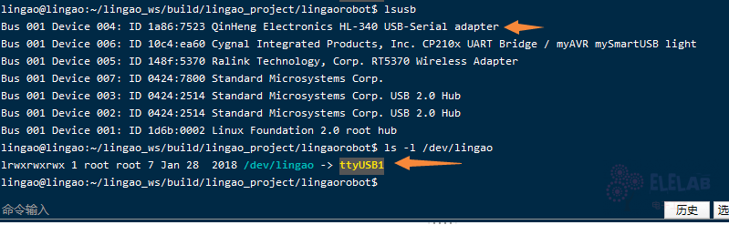
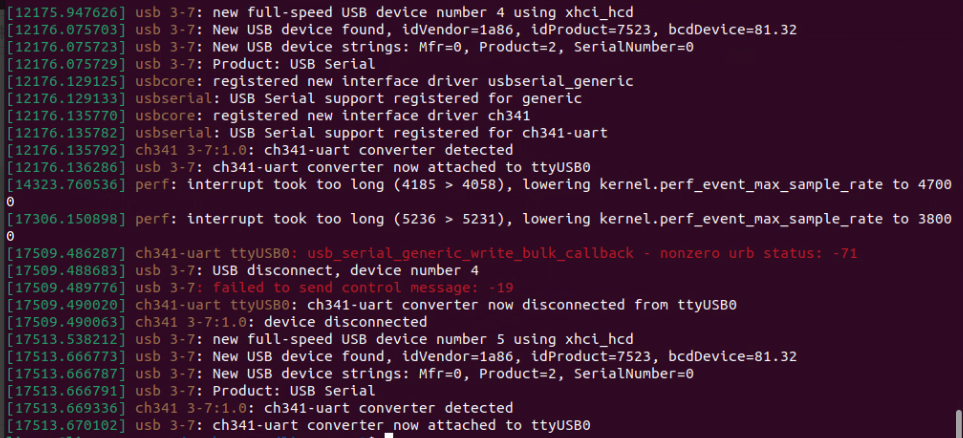
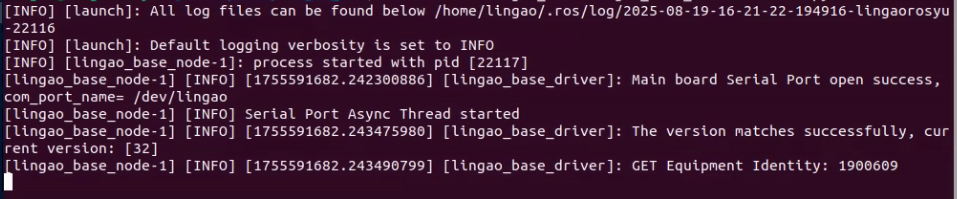
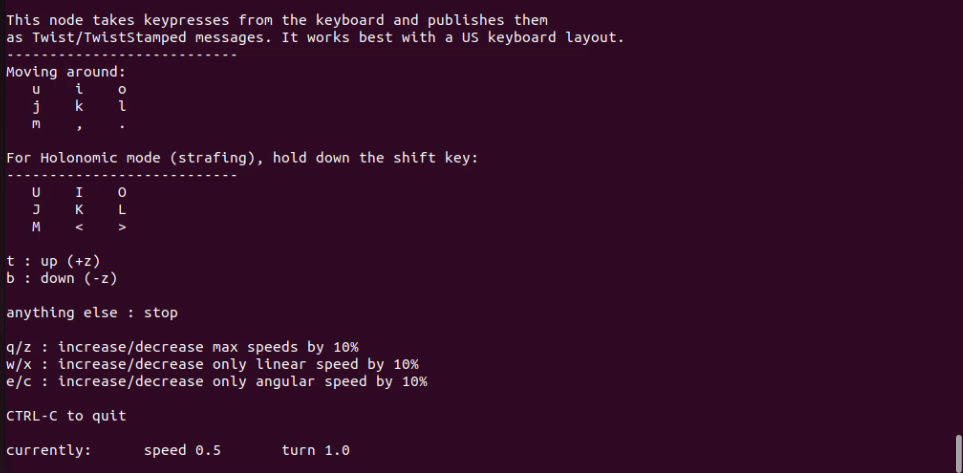

# 下位机通讯测试


# USB连接测试

下位机接入上位机USB串口后检查一下驱动是否成功识别

```linux
$ lsusb
$ ls -l /dev/lingao
```

安装在一键安装的时候添加udev rules规则，可根据usb的PID/VID生成/dev/lingao和/dev/rplidar等软链接，每次开机启动时会自动生成软链接，ttyUSB*号都有所不同，使用udev可以固定软链接名字。



由上图可看出usb已连接并识别成功。

### 若USB还是不识别，请检查下位机是否正常连接：

重新拔插USB线后输入`sudo dmesg`命令检查
```linux
sudo dmesg
```



如上图则是检测成功，
若是检测出`brltty`冲突，需要卸载brltty

```linux
sudo apt remove brltty 
```

# 启动测试

主控板的与上位机启动通讯全靠bringup.launch，该命令处理上位机订阅下位机发送信息或者上位机发布命令到下位机

```linux
# ROS2命令
ros2 launch lingao_base lingao_base_driver.launch.py

# ROS1命令
roslaunch lingao_base lingao_base_driver.launch
 ```
 

没有错误基本上就是启动成功，如果启动失败可能会遇到下面的错误：
* 错误1：`Main board Serial Port open failed` 串口打开失败，请从[USB连接测试](#USB连接测试)开始检查

# 发布 Twist 消息控制(ROS2)
我们可以通过发布 Twist 消息控制小车运动

```linux
ros2 topic pub -r 10 /cmd_vel geometry_msgs/msg/Twist '{linear: {x: 0.3, y: 0, z: 0}, angular: {x: 0, y: 0, z: 0.0}}'
```

现在分解这条命令

– /cmd_vel ：发布话题

– geometry_msgs/Twist ：消息类型

– -r 10 ：以10HZ頻率發布

– ‘{linear: {x: 0.3, y: 0, z: 0}, angular: {x: 0, y: 0, z: 0.0}}’ ： 总结就是让机器人向x轴前进，以线速度：0.3m/s，绕z轴正方向旋转：角速度：0.0ral/s

# 键盘控制
通过安装teleop_twist_keyboard包可使用键盘命令控制程序，通估键盘发布线速度、角速度从而控制小车运动

```linux
sudo apt-get install ros-$ROS_DISTRO-teleop-twist-keyboard
```

```linux
ros2 run teleop_twist_keyboard teleop_twist_keyboard
```



现在可以使用键盘控制小车运行，ROS的通讯测试完毕！

